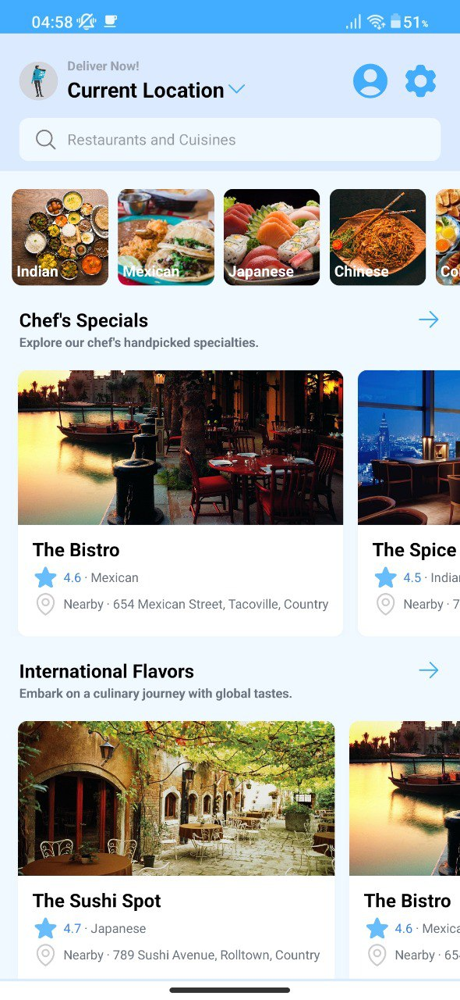
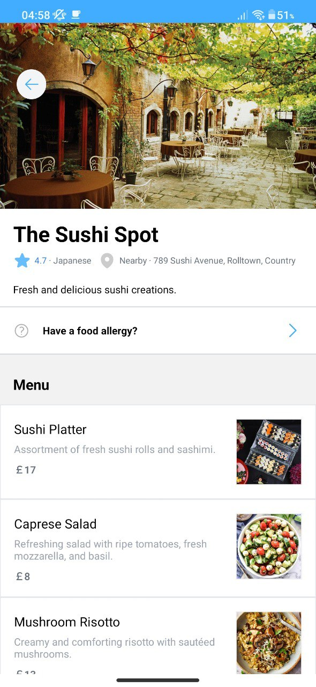
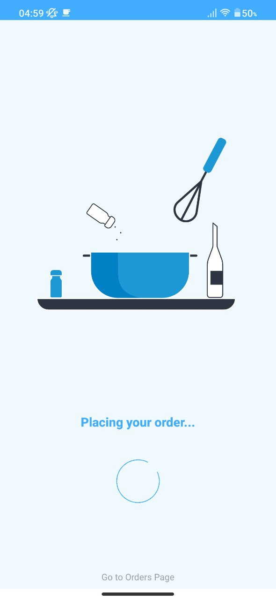
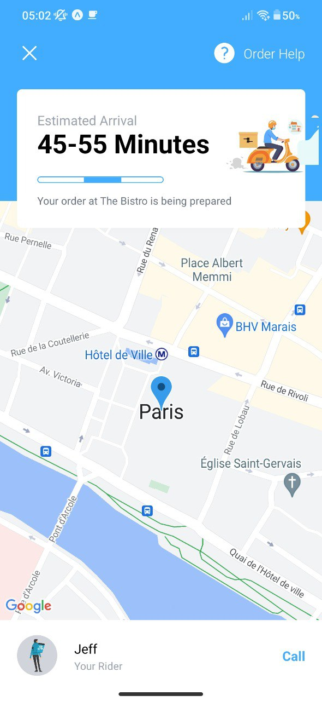

# Bhooka Pet React Native App

This is a mobile application built with React Native for the Bhooka Pet food delivery service. It utilizes Expo for easy development and deployment, Redux for state management, Tailwind CSS for styling, and Sanity for Content management.

## Screenshots

  
  
  
  

## Features

- User registration and authentication
- Browse and search for restaurants and menus
- Place orders and track delivery status
- Integration with Maps for location-based services
- Manage user profile and settings

## Installation

1. Clone the repository:

2. Install dependencies using npm or yarn:

3. Start the development server:

4. Follow the instructions from the Expo CLI to launch the app on a physical device or emulator.

## Configuration

To configure the app, you need to set up some environment variables. Copy the `.env.example` file to `.env` and replace the values with your own:

Make sure to provide the necessary credentials for authentication and any API keys required for Maps integration.

## Folder Structure

- `/assets` - Includes static assets such as images, fonts, etc.
- `/components` - React components used throughout the app.
- `/screens` - Main app screens and their associated components.
- `/store` - Redux store configuration, actions, and reducers.

## Tech Stack

- `React Native` - JavaScript framework for building native mobile apps.
- `Expo` - Development toolchain and platform for React Native apps.
- `Redux` - State management library for predictable state updates.
- `Tailwind CSS` - Utility-first CSS framework for rapid UI development.
- `React Native Maps` - Integration with React Native Maps for location-based services.
- `Sanity` - Content management and delivery network.

## Contributing

Contributions are welcome! If you find any issues or have ideas for new features, please open an issue or submit a pull request.
